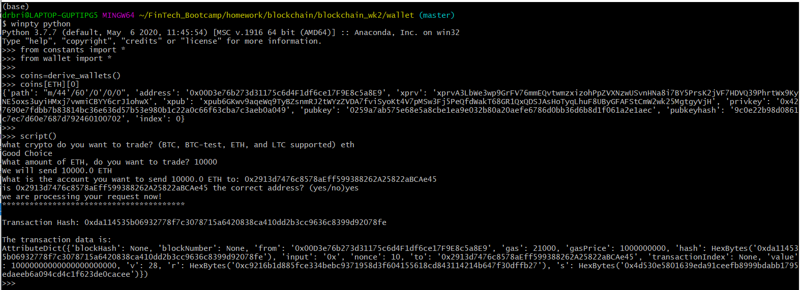

# Blockchain_wk2 
### How to run my wallet
* the first step is to open a git bash window and navigate to the wallet directory
* open a python shell in the wallet directory by typing **winpty python** command
    
* once in the python shell (you should see **>>>** as the prompt) import the wallet.py and constants.py 
    * from constants import *
    * from wallet import *
    
* now you can run your transactions
    * first run **coins=derive_wallets()** to get the addresses and private keys for all the coins your wallet is set up to trade.  below you see the output for the first entry in the ETH dictionary within the coins object
    
    * next run **script()** and it will prompt you for the rest of the informaton needed for the transaction (amount, coin to trade, where to send the coin) and return the transaction hash and track the transaction
    * this is an example of running **script()** to trade ETH
    
    * and it really did trade the ETH(caveat, i was using a private PoA network, and had the nodes running in separate bash terminals)
    
    * this is an example of running **script()** to trade test BTC
    
    
    * and it really did trade the BTC-test coins
    
Create a README.md that contains the test transaction screenshots, as well as the code used to send them. Pair the screenshot with the line(s) of code.

* wallet.py contains all the functions you will need to transfer ETH, BTC, BTC-test, or LTC using python.  The file contains several modules:
    * derive_wallets: this function derives addresses and private keys for each of the coins using our mnemonic which is read in as on environmental variable
    
~~~
def derive_wallets():
    mnem=os.getenv("MNEMONIC")
    coins={}
    types=[BTC, BTCTEST, ETH, LTC]
    for type in types:
        command = f'php derive -g --mnemonic=mnem --coin={type} --numderive=3 --format=json'
        p = subprocess.Popen(command, stdout=subprocess.PIPE, shell=True)
        (output, err) = p.communicate()
        keys = json.loads(output)
        coins[type]=keys
    return coins
~~~

    * script: this functions runs all the steps required to complete and track the transaction
    
~~~
def script():  
    coin, amount, to = trans_data()
    account=priv_key_to_account(coin, coins)
    result=send_tx(coin, account, to, amount)
    print('*'*40)
    print(f'\nTransaction Hash: {result}')
    trans_log=track_trans(result, coin)
    print('\nThe transaction data is:')
    return trans_log
~~~

    * trans_data: this function collect the coin being sent, the amount of coin, and the address to send the coin to (The function has a few helper functions which validate the inputted data, which I am not showing here for brevity).
        
~~~
def trans_data():
    c=0
    while c==0:
        coin=input("what crypto do you want to trade? (BTC, BTC-test, ETH, and LTC supported) ").lower()
        c=validate_coin(coin)
    print('Good Choice')
    a=0
    while a==0:
        amount_str=input(f"What amount of {coin.upper()}, do you want to trade? ")
        a, amount = validate_amount(amount_str, coin)
    print(f'We will send {amount} {coin.upper()}')
    a=0
    while a==0:
        to=input(f'What is the account you want to send {amount} {coin.upper()} to: ')
        confirm=input(f'is {to} the correct address? (yes/no)').lower()
        if confirm=='yes':
            a=1
    print('we are processing your request now!')
    return coin, amount, to
~~~

    * priv_key_to_account: This function takes the private key for the coin of choice and creates an object containing all the meta data needed to send the coins
    
~~~
def priv_key_to_account(coin, coins):
    if coin==ETH:
        key=coins[coin][0]['privkey']
        return Account.privateKeyToAccount(key)
    elif coin==BTC:
        key=coins[coin][0]['privkey']
        return PrivateKey(key)
    elif coin==BTCTEST:
        key=coins[coin][0]['privkey']
        return PrivateKeyTestnet(key)
    elif coin==LTC:
        key=coins[coin][0]['privkey']
        return HDWallet.create(name='Simple_Wallet2', keys=key)
    
~~~

    * send_tx: script() sends this function all the transaction data the user provided, sends it to create_tx() to generate the raw transaction, and then sends this raw transaction to the network to complete the trade, returning the transaction hash
    
~~~
def send_tx(coin, account, to, amount):
    tx = create_tx(coin,account, to, amount)
    if coin==ETH:
        w3 = Web3(Web3.HTTPProvider("http://127.0.0.1:8545"))
        signed_tx = account.sign_transaction(tx)
        result=w3.eth.sendRawTransaction(signed_tx.rawTransaction)
        return result.hex()
    elif coin==BTC or coin==BTCTEST:
        result=account.send([(to, amount, BTC)])
        return result
    elif coin==LTC:
        return return account.send([(to, amount, BTC)], network='litecoin')
~~~

    * create_tx:  send_tx() calls this function which then creates and returns the raw transaction.
    
~~~
def create_tx(coin, account, to, amount):
    if coin==ETH:
        w3 = Web3(Web3.HTTPProvider("http://127.0.0.1:8545"))
        gasEstimate = w3.eth.estimateGas(
        {"from": account.address, "to": to, "value": amount}
        )
        return {
            "from": account.address,
            "to": to,
            "value": amount,
            "gasPrice": w3.eth.gasPrice,
            "gas": gasEstimate,
            "nonce": w3.eth.getTransactionCount(account.address),
        }
    elif coin==BTC or coin==BTCTEST:
        return account.create_transaction([(to, amount, BTC)])
    elif coin==LTC:
        account.transaction_create([(to, amount, BTC)], network='litecoin')
~~~

    * track_trans: using the transaction hash, this fuctions tracks the transaction and returns the result.  trying to track the transaction immediately after sending routinely fails, so a 30 second delay is used to give the network time to absorb the transaction
    
~~~
def track_trans(result, coin):
    if coin==ETH:
        w3 = Web3(Web3.HTTPProvider("http://127.0.0.1:8545"))
        return w3.eth.getTransaction(result)
    elif coin==BTC: 
        time.sleep(30)
        url = f'https://sochain.com/api/v2/get_tx/BTC/{result}'
        response_data = requests.get(url)
        return response_data.json() 
    elif coin==BTCTEST:
        time.sleep(30)
        url=f'https://sochain.com/api/v2/get_tx/BTCTEST/{result}'
        response_data = requests.get(url)
        return response_data.json() 
    elif coin==LTC:
        time.sleep(30)
        url=f'https://sochain.com/api/v2/get_tx/LTC/{result}'
        response_data = requests.get(url)
        return response_data.json() 
~~~
  
* To access lite coin I am using the bitcoinlib library, and used it accounding to the provided examples:
    * pip install bitcoinlib to install the package
    * bitcoinlib examples https://github.com/1200wd/bitcoinlib/blob/master/examples/wallets.py
* I have hd-wallet-derived included in the repo, but I have providing the instructions for how to set it up:
    * open a new git bash terminal from C:\Program Files\Git\bin\bash.exe do the following commands
        * git clone https://github.com/dan-da/hd-wallet-derive
        * cd hd-wallet-derive
        * php -r "readfile('https://getcomposer.org/installer');" | php
        * php -d pcre.jit=0 composer.phar install
    * now open a new bash terminal with admin rights and do the follow command in the wallet folder:
        * export MSYS=winsymlinks:nativestrict
        * ln -s hd-wallet-derive/hd-wallet-derive.php derive
    * you should now have a fully installed hd-wallet-derive library and a alias allowing us to use it in the active directory.